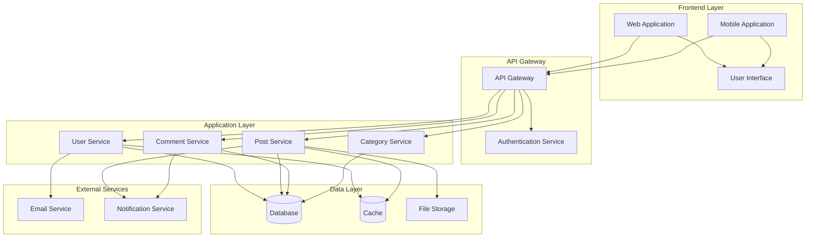

# Component Diagram

## Overview
The Component Diagram shows the high-level architecture and organization of the software system, illustrating the components and their dependencies.

## Diagram

## Component Descriptions

### Frontend Layer
- **User Interface**: Shared UI component library containing reusable components, design system, and common UI elements used by both web and mobile applications
- **Web Application**: Browser-based client application that uses the UI library and communicates with the API Gateway
- **Mobile Application**: Native/hybrid mobile client that uses the UI library and communicates with the API Gateway

### API Gateway
- **API Gateway**: Central entry point for all client requests, handles routing and load balancing
- **Authentication Service**: Manages user authentication and authorization

### Application Layer
- **User Service**: Handles user management, registration, and profile operations
- **Post Service**: Manages post creation, updates, and retrieval
- **Comment Service**: Handles comment creation and management
- **Category Service**: Manages categories and post classification

### Data Layer
- **Database**: Primary data store for persistent data
- **Cache**: Temporary storage for frequently accessed data
- **File Storage**: Storage for media files and attachments

### External Services
- **Email Service**: Handles email notifications and communications
- **Notification Service**: Manages push notifications and alerts

## Communication Patterns
- All client applications communicate through the API Gateway
- Services communicate with the database for data persistence
- Caching layer reduces database load for frequently accessed data
- External services handle asynchronous communication tasks
