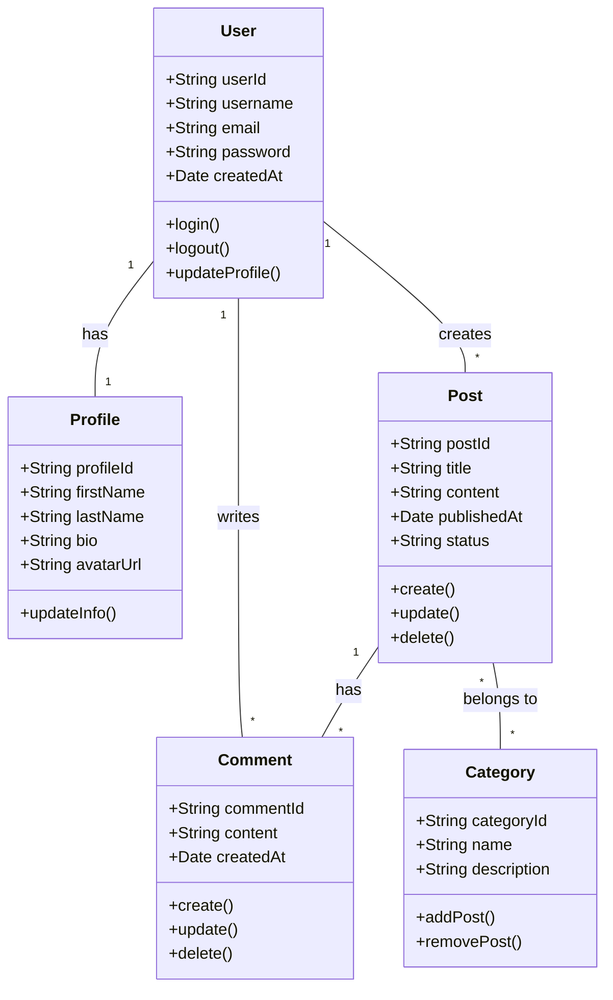

# Domain Model

## Overview
The Domain Model represents the key concepts and relationships in the problem domain of our application.

## Diagram

## Key Entities

### User
Represents a registered user in the system with authentication capabilities.

### Profile
Contains detailed information about a user including personal details and preferences.

### Post
Represents content created by users that can be published and categorized.

### Comment
Represents user feedback and discussion on posts.

### Category
Represents a way to organize and classify posts.

## Relationships
- Each User has one Profile
- Users can create multiple Posts
- Users can write multiple Comments
- Posts can have multiple Comments
- Posts can belong to multiple Categories
