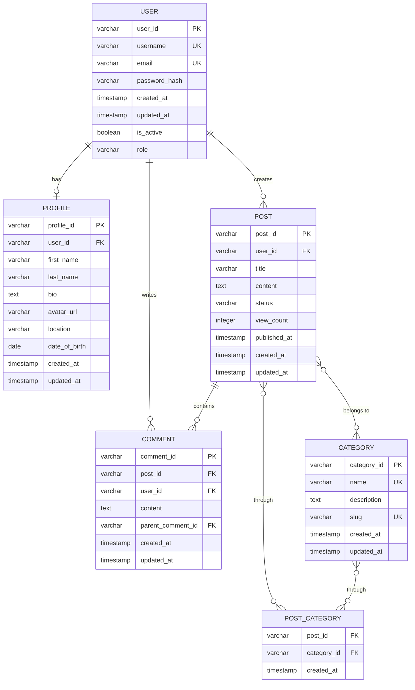

# Entity-Relationship (ER) Model

## Overview
The ER Model defines the database structure, showing entities, their attributes, and relationships between them.

## Diagram

## Entity Descriptions

### USER
Stores user account information and credentials.
- **Primary Key**: user_id
- **Unique Keys**: username, email
- **Relationships**: 
  - Has one PROFILE
  - Creates many POSTs
  - Writes many COMMENTs

### PROFILE
Contains detailed user profile information.
- **Primary Key**: profile_id
- **Foreign Keys**: user_id (references USER)
- **Relationships**: Belongs to one USER

### POST
Represents content created by users.
- **Primary Key**: post_id
- **Foreign Keys**: user_id (references USER)
- **Relationships**: 
  - Belongs to one USER
  - Contains many COMMENTs
  - Belongs to many CATEGORYs (through POST_CATEGORY)

### COMMENT
Represents user comments on posts.
- **Primary Key**: comment_id
- **Foreign Keys**: 
  - post_id (references POST)
  - user_id (references USER)
  - parent_comment_id (references COMMENT, for nested comments)
- **Relationships**: 
  - Belongs to one POST
  - Belongs to one USER
  - Can have parent COMMENT (for threading)

### CATEGORY
Represents classification categories for posts.
- **Primary Key**: category_id
- **Unique Keys**: name, slug
- **Relationships**: Associated with many POSTs (through POST_CATEGORY)

### POST_CATEGORY
Junction table for many-to-many relationship between posts and categories.
- **Composite Primary Key**: (post_id, category_id)
- **Foreign Keys**: 
  - post_id (references POST)
  - category_id (references CATEGORY)

## Indexing Strategy
- Primary keys on all tables
- Unique indexes on username, email (USER)
- Unique indexes on name, slug (CATEGORY)
- Foreign key indexes for improved join performance
- Index on post.published_at for chronological queries
- Index on comment.post_id for efficient comment retrieval

## Data Constraints
- user.email must be valid email format
- user.password_hash must be securely hashed
- post.status enum: ['draft', 'published', 'archived']
- user.role enum: ['user', 'moderator', 'admin']
- Timestamps automatically managed by database
